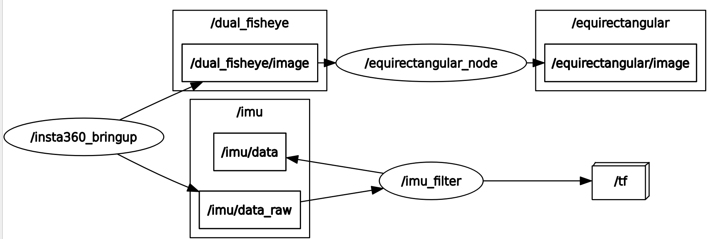

# insta360_ros_driver


A ROS driver for the Insta360 cameras. This driver is tested on ROS2 Jazzy and has 2 main features:

- `INSV2BAG Converter`: A ROS2 node decoding Insta360 dual-fisheye video files (INSV format), extracting embedded IMU data and dual fisheye frames and saving into ros2 bag files. 
- `Livestream Extractor`: A ROS2 node decoding Insta360 livestream and publishing IMU data and dual fisheye frames.

The driver has also been verified on the Insta360 X2, X3 and X5 cameras. The following resolutions are available, all at 30 FPS.
- 3840 x 1920
- 2560 x 1280
- 2304 x 1152
- 1920 x 960

You can change [this line](https://github.com/ai4ce/insta360_ros_driver/blob/79588d9e0e9d029c3371d4095ea718daaf1e06fb/src/main.cpp#L126) to edit the resolution.

## Installation
```
cd ~/colcon_ws/src
git clone https://github.com/Alexander-guo/insta360_ros2.git
cd ..
```
An Insta360 SDK is needed to use `Livestream Extractor`. If you want to update it to the latest version of SDK, apply from the [Insta360 website](https://www.insta360.com/sdk/home). 

For additional instructions, see this [post](https://github.com/ai4ce/insta360_ros_driver/issues/10#issuecomment-3371481987).

Then, the latest Insta360 libraries need to be installed as follows:
- Replace the <code>camera</code> and <code>stream</code> header files inside the <code>include</code> directory with new files.
- Replace the <code>libCameraSDK.so</code> library under the <code>lib</code> directory with new files.

**Note: This package works with the SDK posted after April 23, 2025 and a proper version of SDK is already included in this repo.**

Afterwards, install the other required dependencies and build
```
rosdep install --from-paths src --ignore-src -r -y
colcon build --symlink-install --event-handlers console_direct+
source install/setup.bash
```

***
### The following setup for device mounting is only for `Livestream Extractor`:

Before continuing, **make sure the camera is set to dual-lens mode**.

Additionally, **ensure the camera's USB mode is set to Android**:
1. On the camera, swipe down the screen to the main menu
2. Go to Settings -> General
3. Set USB Mode to **Android** (not Webcam or other modes)
4. This is required for the ROS driver to properly detect and communicate with the camera (see [Issue #4](https://github.com/ai4ce/insta360_ros_driver/issues/4))

The Insta360 requires sudo privilege to be accessed via USB. To compensate for this, a udev configuration can be automatically created that will only request for sudo once. The camera can thus be setup initially via:
```
cd ~/ros2_ws/src/insta360_ros_driver
./setup.sh
```
This creates a symlink  based on the vendor ID of Insta360 cameras. The symlink, in this case <code>/dev/insta</code> is used to grant permissions to the usb port used by the camera. **Make sure you run it on your host system if you are in a container!!**


**Sometimes, this does not work (e.g. you see "device /dev/insta not found" or something similar). You can try entering the commands manually, since that sometimes sees success, especially for the first time.**
```
echo SUBSYSTEM=='"usb"', ATTR{manufacturer}=='"Arashi Vision"', SYMLINK+='"insta"', MODE='"0777"' | sudo tee /etc/udev/rules.d/99-insta.rules
sudo udevadm control --reload-rules
sudo udevadm trigger
sudo chmod 777 /dev/insta
```

## Usage

### `INSV2BAG Converter`
```
ros2 launch insta360_ros_driver insv_dual_fisheye_bag.launch.py file_path:=<path_to_INSV_file> bag_path:=<path_to_output_bag>
```
Check parameters in [insv_dual_fisheye_bag_node.cpp](src/insv_dual_fisheye_bag_node.cpp)  and modify accordingly in [insv_dual_fisheye_bag.launch.py](launch/insv_dual_fisheye_bag.launch.py).

#### Saved Topics:
- /insta360/front/image_raw(/compressed)
- /insta360/rear/image_raw(/compressed)
- /insta360/imu

IMU topic frequency is ~1000Hz tested with INSV files recorded by Insta360 X5.

### `Livestream Etractor` Camera Bringup
The camera provides images natively in H264 compressed image format.

The camera can be brought up with the following launch file
```
ros2 launch insta360_ros_driver bringup.launch.xml
```


A dual fisheye image will be published.


#### Published Topics
- /dual_fisheye/image
- /dual_fisheye/image/compressed
- /equirectangular/image
- /imu/data
- /imu/data_raw

The launch file has the following optional arguments:
- equirectangular (default="false")

This publishes equirectangular images. You can configure these parameters in `config/equirectangular.yaml`.


- imu_filter (default="true")

This uses the [imu_filter_madgwick](https://wiki.ros.org/imu_filter_madgwick) package to approximate orientation from the IMU. Note that by default, we publish `/imu/data_raw` which only contains linear acceleration and angular velocity. The madgwick filter uses this information to publish orientation to `/imu/data`. You can configure the filter in `config/imu_filter.yaml`. 


## Equirectangular Calibration
You can adjust the extrinsic parameters used to improve the equirectangular image. 
```
# Run the camera driver
ros2 run insta360_ros_driver insta360_ros_driver
# Activate image decoding
ros2 run insta360_ros_driver decoder
# Run the equirectangular node in calibration mode
ros2 run insta360_ros_driver equirectangular.py --calibrate
```
This will open an app to adjust the extrinsics. You can press 's' to get the parameters in YAML format.


Pressing 's' will return the parameters via the terminal. You can copy paste this onto the configuration file as needed. By default, the launch file reads this from `config/equirectangular.yaml`

```
==================================================
CALIBRATION PARAMETERS (YAML FORMAT)
==================================================
equirectangular_node:
  ros__parameters:
    cx_offset: 0.0
    cy_offset: 0.0
    crop_size: 960
    translation: [0.0, 0.0, -0.105]
    rotation_deg: [-0.5, 0.0, 1.1]
    gpu: True
    out_width: 1920
    out_height: 960
==================================================
```

Note that decode.py will most likely drop frames depending on your system. If you do not care about live processing, you can simply record the `/dual_fisheye/image/compressed` topic and decompress it later after recording.
```
ros2 bag record /dual_fisheye/image /imu/data_raw
```

<!-- ## Star History

[](https://star-history.com/#ai4ce/insta360_ros_driver&Date) -->


## TODO
- `INSV2BAG Converter`:
  - Enable Multi-threading to accelerate conversion.